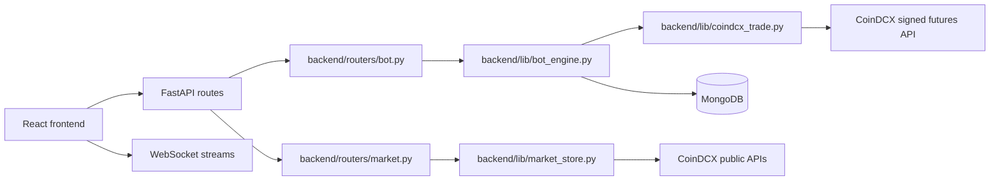

# Scalping Bot Architecture

## Overview

This project is a CoinDCX futures scanner + strategy runner that operates in two modes:

- PAPER mode: same decision flow, simulated fills, no money at risk
- LIVE mode: only when valid credentials exist and the live toggle is enabled

The real execution path is controlled in Python, not by a public trade endpoint. The app uses the backend engine to decide, size, validate, and submit a futures order on CoinDCX.

## Runtime architecture



## Execution flow

1. User creates a strategy from the frontend with chosen capital, leverage, TP %, SL %, timeframe, and rule set.
2. The strategy is saved through `/api/bot/strategies`.
3. The bot engine schedules the strategy by timeframe and near the candle close.
4. A signal is evaluated from market data and the selected strategy rule.
5. The engine calculates quantity using the selected capital, leverage, instrument metadata, and USDT/INR conversion.
6. Before a live order is allowed, the backend verifies:
   - credentials exist
   - live-trading toggle is enabled (`true`)
   - free INR futures wallet balance is sufficient
   - pair is valid for INR margin
7. If a live order is allowed, the engine calls the signed CoinDCX futures order API.
8. If not, the system stays in PAPER mode and simulates the fill.

## Why INR margin matters

CoinDCX uses the same pair symbol across different margin books. The wallet choice is not inferred from the pair alone. The actual order must include:

```json
"margin_currency_short_name": "INR"
```

This is how the backend ensures it is using the INR futures wallet instead of some other book.

## Key files

- `backend/server.py` — app startup and route registration
- `backend/routers/bot.py` — strategy CRUD, credentials, bot toggle, live-state routes
- `backend/routers/market.py` — market snapshot and candle routes
- `backend/strategies/registry.py` — dynamic strategy registry, template metadata, and runtime config lookup
- `backend/strategies/Strategy2.py` — reversal strategy logic and strategy-owned runtime config
- `backend/strategies/Strategy3.py` — highest-mover strategy logic and strategy-owned runtime config
- `backend/strategies/Strategy4.py` — additional strategy module for optional custom logic
- `backend/lib/bot_engine.py` — scheduling, orchestration, order sizing, fill monitoring, and execution state machine
- `backend/lib/coindcx_trade.py` — signed CoinDCX futures client, wallet logic, order creation, TP/SL attach
- `backend/lib/credentials.py` — `CredentialsService`, credential storage, and live toggle persistence
- `backend/lib/config.py` — `ConfigService` and typed environment configuration
- `frontend/src/components/bot/AddStrategyDialog.tsx` — dynamic template-driven strategy form
- `frontend/src/lib/botTypes.ts` — shared strategy and template type contracts

## Public app endpoints

All routes are prefixed by `/api`.

### Market endpoints

- `GET /api/market/snapshot`
- `GET /api/market/instrument/{pair}`
- `GET /api/market/candles/{pair}`
- WebSocket `/api/market/ws`

### Bot endpoints

- `GET /api/bot/state`
- `POST /api/bot/toggle`
- `GET /api/bot/strategies`
- `POST /api/bot/strategies`
- `DELETE /api/bot/strategies/{sid}`
- `POST /api/bot/strategies/{sid}/enabled`
- `GET /api/bot/logs`
- `GET /api/bot/trades`
- `GET /api/bot/positions`
- `GET /api/bot/credentials`
- `POST /api/bot/credentials`
- `POST /api/bot/credentials/validate`
- `POST /api/bot/credentials/live`
- `GET /api/bot/trade-api-audit` — sanitized signed-exchange request/response audit
- WebSocket `/api/bot/ws`

## Real-money execution contract

There is no separate public order execution route in this app. The actual trade route is internal to the backend and goes directly to CoinDCX.

The live order route used by the backend is:

- `POST /exchange/v1/derivatives/futures/orders/create`

Payload example:

```json
{
  "order": {
    "side": "sell",
    "pair": "B-BTC_USDT",
    "order_type": "market_order",
    "total_quantity": 0.02,
    "leverage": 10,
    "notification": "no_notification",
    "time_in_force": "good_till_cancel",
    "hidden": false,
    "post_only": false,
    "margin_currency_short_name": "INR"
  }
}
```

TP/SL attach example:

```json
{
  "id": "position_123",
  "take_profit": {
    "stop_price": 81000.0,
    "order_type": "take_profit_market"
  },
  "stop_loss": {
    "stop_price": 76000.0,
    "order_type": "stop_market"
  }
}
```

## Safety and validation

The app intentionally blocks live orders unless all criteria are met. This includes:

- real credentials loaded
- live-trading toggle enabled (`true`)
- usable free INR futures wallet balance available
- quantity and price aligned to instrument tick rules
- pair available for INR-margin trading

This is what separates paper mode from actual execution.


### 2. **Market Data Flow** (Real-time Prices)

```
CoinDCX WebSocket ("currentPrices@futures@rt")
    │
    ├─→ market_store._price_loop()
    │   └─→ MarketStore._apply() updates in-memory tickers
    │       ├─→ Calculates 24h change %
    │       └─→ Sorts by change_pct, takes top 4
    │
    ├─→ MarketStore._broadcast()
    │   └─→ Sends JSON snapshot to all WebSocket subscribers
    │
    └─→ Frontend WebSocket (/api/market/ws)
        └─→ useBotStream() updates state
            └─→ Re-renders Dashboard, InstrumentTable
```

### 3. **Bot Execution Flow** (Strategy Entry-to-Exit)

```
bot_engine._monitor_loop() every 2 seconds
    │
    ├─→ IS BOT ON?
    │   └─→ No → sleep, check again
    │   └─→ Yes → continue
    │
    ├─→ FOR EACH ENABLED STRATEGY:
    │   │
    │   ├─→ WAITING STATE
    │   │   └─→ Next slot in 60 seconds?
    │   │       └─→ Yes → SCANNING state
    │   │       └─→ No → sleep
    │   │
    │   ├─→ SCANNING STATE (60s before slot)
    │   │   ├─→ Fetch top 4 from market_store
    │   │   ├─→ Read strategy candle (just closed)
    │   │   ├─→ candle_side() → BUY (green) or SELL (red)
    │   │   └─→ Pick strongest 24h mover → PENDING_ORDER state
    │   │
    │   ├─→ PENDING_ORDER STATE (fill window: 1-5 min depending on TF)
    │   │   ├─→ Place LIMIT order at candle close price
    │   │   ├─→ Wait for fill within order_window()
    │   │   ├─→ Order filled? → IN_POSITION state
    │   │   └─→ Timeout? → Cancel, WAITING state
    │   │
    │   └─→ IN_POSITION STATE
    │       ├─→ Monitor live price vs TP/SL
    │       ├─→ Price hits TP? → CLOSED (profit)
    │       ├─→ Price hits SL? → CLOSED (loss)
    │       └─→ Exit → Trade persisted to MongoDB
    │
    └─→ Broadcast engine.state() to all WebSocket subscribers (/api/bot/ws)
```

### 4. **Order Placement Flow**

```
Strategy at PENDING_ORDER state
    │
    ├─→ coindcx_trade.place_order()
    │   ├─→ Check runtime live toggle state (boolean)
    │   ├─→ Convert INR capital → USDT contract quantity
    │   ├─→ live=false? → Simulate (store in mock positions)
    │   └─→ live=true? → Send signed API call to CoinDCX
    │
    ├─→ Order placed (paper or live)
    │   └─→ Save to MongoDB trades collection
    │
    └─→ Poll for fill
        ├─→ Check order status
        ├─→ Filled? → Attach TP/SL → IN_POSITION
        └─→ Unfilled after window? → Cancel, retry up to 3 times
```

### 5. **Frontend State Update Flow**

```
React page mounts (e.g., BotControl.tsx)
    │
    ├─→ useQuery() fetches initial state via REST
    │   └─→ GET /api/bot/state → BotState snapshot
    │
    ├─→ useEffect() opens WebSocket
    │   └─→ WS /api/bot/ws
    │
    └─→ WebSocket listener
        ├─→ { type: "state", state: BotState } → setState()
        ├─→ { type: "positions", positions: [...] } → setPositions()
        ├─→ { type: "log", log: LogEntry } → append to logs
        └─→ Component re-renders with latest data
```

---

## 📊 Trading Lifecycle

### Complete Flow with State Transitions

**Timeframe:** 5m (5-minute candles)
**Trading Window:** 05:30 - 03:40 IST (wraps midnight)
**Slots:** :00, :05, :10, :15, etc.

```
SLOT @ 14:20 IST (2:20 PM)
│
├─→ 14:19 (60s before)
│   ├─→ Strategy: SCANNING
│   ├─→ Fetch top 4 coins (sorted by 24h % change)
│   ├─→ Top gainer: SOL_USDT +5.2%
│   └─→ Read 14:15-14:20 candle
│       ├─→ open=105.50, close=106.80 (GREEN)
│       └─→ Decision: BUY
│
├─→ 14:20:00
│   ├─→ Strategy: PENDING_ORDER
│   ├─→ Qty = 40000 INR ÷ 106.80 ÷ 10 leverage ÷ 1 increment = 37 contracts
│   ├─→ Place LIMIT order: 37 SOL @ 106.80 (entry price)
│   ├─→ TP = 106.80 + (106.80 × 0.5%) = 107.34
│   ├─→ SL = 106.80 - (106.80 × 5%) = 101.46
│   └─→ Save to MongoDB
│
├─→ 14:20 → 14:21 (1 min fill window)
│   ├─→ Poll CoinDCX: "Is order filled?"
│   ├─→ 14:20:45 → Filled at 106.82
│   └─→ Strategy: IN_POSITION
│
├─→ 14:21 → 14:35 (monitoring)
│   ├─→ Update trade status in MongoDB
│   ├─→ Every 2s: Check live price
│   ├─→ 14:28: Price = 107.40 (TP triggers!)
│   ├─→ Market order: Sell 37 SOL @ 107.35
│   └─→ Strategy: back to WAITING
│
└─→ Trade saved to MongoDB
    ├─→ Entry: 106.82 @ 14:20:45
    ├─→ Exit: 107.35 @ 14:28:12
    ├─→ PnL = (107.35 - 106.82) × 37 = ₹19.67 ≈ ₹197
    └─→ Next slot: 14:25
```

---

## 🛣️ API Routes

### Bot Endpoints (/api/bot)

| Method | Path | Handler | Function |
|--------|------|---------|----------|
| GET | `/state` | `get_state()` | Return current BotState (strategies, status) |
| POST | `/toggle` | `toggle_bot()` | Turn bot on/off |
| GET | `/strategies` | `list_strategies()` | All strategies with current status |
| POST | `/strategies` | `create_strategy()` | Create new strategy |
| GET | `/strategies/{id}` | `get_strategy()` | Get one strategy |
| PUT | `/strategies/{id}` | `update_strategy()` | Modify strategy |
| DELETE | `/strategies/{id}` | `delete_strategy()` | Remove strategy |
| GET | `/positions` | `list_positions()` | All live open positions |
| GET | `/trades` | `list_trades()` | Closed trades (paginated) |
| GET | `/trades?date=2026-08-30&limit=50` | `list_trades_by_date()` | Trades for specific date |
| GET | `/history/today` | `today_summary()` | Today's PnL summary |
| GET | `/history/daily?days=30` | `daily_pnl()` | Last N days PnL |
| GET | `/logs?limit=100` | `get_logs()` | Recent log entries |
| GET | `/credentials` | `get_credentials()` | Check if keys configured |
| POST | `/credentials` | `set_credentials()` | Store API keys |
| POST | `/historical-test` | `historical_test()` | Backtest strategy on past candles |
| WS | `/ws` | `bot_ws()` | WebSocket: state, logs, positions |

### Market Endpoints (/api/market)

| Method | Path | Handler | Function |
|--------|------|---------|----------|
| GET | `/snapshot` | `market_snapshot()` | Latest ticker ranking + top 4 |
| GET | `/candles/{pair}?resolution=5m&limit=60` | `get_candles()` | OHLCV for a pair |
| WS | `/ws` | `market_ws()` | WebSocket: market snapshot stream |

---

## 🎨 Frontend Components

### Page Hierarchy

```
App.tsx
├── <Route path="/">
│   └── Dashboard.tsx
│       ├── TopGainerBox (top 4 coins)
│       └── InstrumentTable (all pairs with filters)
│
├── <Route path="/bot">
│   └── BotControl.tsx
│       ├── StrategyList (cards for each strategy)
│       │   └── TradePositionCard (live positions expanded)
│       │       └── PositionChart (CandleChart with levels)
│       ├── AddStrategyDialog (form to create)
│       └── ApiKeysDialog (credentials input)
│
├── <Route path="/position">
│   └── PositionMonitor.tsx
│       └── PositionChart[] (detailed per position)
│
├── <Route path="/history">
│   └── TradeHistory.tsx
│       ├── PnlCalendar (daily heatmap)
│       └── Trade list (closed trades + metadata)
│
└── <Route path="/testing">
    └── HistoricalTesting.tsx
        ├── Strategy picker
        ├── Date/time input
        └── Backtest results (entry/exit points)
```

### Component Details

| Component | Purpose | Key Props |
|-----------|---------|-----------|
| **CandleChart** | TradingView-style OHLCV + volume | `candles`, `ticker`, `height` |
| **TradePositionCard** | Single position display + chart | `record` (Trade \| LivePosition) |
| **StrategyList** | All strategies as expandable cards | strategies[], onEdit |
| **InstrumentTable** | Sortable ticker table | instruments[], snapshot |
| **TopGainerBox** | Top 4 coins display | top[], ticks |
| **LogConsole** | Event log viewer | logs[] |
| **PnlCalendar** | Daily PnL heatmap | dailyPnl[] |
| **AddStrategyDialog** | Strategy creation form | onAdd callback |
| **ApiKeysDialog** | Credential input | onSave callback |

---

## 🔧 Key Functions & Locations

### Backend Core Functions

#### `bot_engine.py`

| Function | Purpose |
|----------|---------|
| `next_slot(moment, timeframe)` | Calculate next candle boundary |
| `candle_side(candle)` | Determine BUY/SELL from candle |
| `candle_close_label(candle, tf_minutes)` | Format candle time range |
| `in_window(moment)` | Check if inside trading window |
| `Engine.load()` | Load strategies from MongoDB |
| `Engine._monitor_loop()` | Main execution loop (every 2s) |
| `Engine._evaluate_strategy()` | Execute one strategy: scan → order → monitor |
| `Engine._place_order()` | Send order to CoinDCX |
| `Engine._poll_fill()` | Monitor order status |
| `Engine._monitor_position()` | Check TP/SL, exit if triggered |
| `Engine.state()` | Return current BotState snapshot |

#### `market_store.py`

| Function | Purpose |
|----------|---------|
| `MarketStore.snapshot()` | Return ranked Snapshot (top 4) |
| `MarketStore.subscribe()` | Register WebSocket client |
| `MarketStore.unsubscribe()` | Unregister WebSocket client |
| `MarketStore._broadcast()` | Send snapshot to all subscribers |
| `MarketStore._apply(ts, prices)` | Ingest price update → update tickers |
| `MarketStore._price_loop()` | Background: connect WebSocket, listen for prices |

#### `candles.py`

| Function | Purpose |
|----------|---------|
| `fetch_candles(pair, resolution, limit)` | GET OHLCV from CoinDCX API |
| `synthesize_2h_candles(pair, limit)` | Combine two 1h candles → 2h candle |
| `get_candle_cache()` | In-memory candle cache |
| `clear_cache()` | Flush stale candles |

#### `coindcx_trade.py`

| Function | Purpose |
|----------|---------|
| `place_order(pair, side, qty, price, tp, sl)` | Create LIMIT order (paper or live) |
| `cancel_order(order_id)` | Cancel unfilled order |
| `get_order_status(order_id)` | Check if filled |
| `close_position(trade_id)` | Market close (exit TP/SL) |
| `get_positions()` | Fetch live positions from exchange |

#### `credentials.py`

| Function | Purpose |
|----------|---------|
| `load()` | Load API keys from MongoDB on startup |
| `get_credentials()` | Return stored (public only) |
| `set_credentials(key, secret)` | Store encrypted in MongoDB |
| `has_credentials()` | Boolean check |

#### `db.py`

| Function | Purpose |
|----------|---------|
| `motor.AsyncClient()` | MongoDB async client (singleton) |
| `db.strategies` | Collection: stored strategies |
| `db.trades` | Collection: completed trades |
| `db.bot_logs` | Collection: event log |
| `db.credentials` | Collection: API keys |

### Frontend Hooks

#### `useBotStream.ts`

```typescript
export function useBotStream(): BotStream {
  // REST init load
  useQuery("bot-state", () => apiGet("/bot/state"))
  useQuery("bot-logs", () => apiGet("/bot/logs?limit=1000"))

  // WS connection
  useEffect(() => {
    socket = new WebSocket(wsUrl())
    socket.onmessage = (frame) => {
      if (frame.type === "state") setState(...)
      if (frame.type === "log") addLog(...)
      if (frame.type === "positions") setPositions(...)
    }
  })

  return { state, positions, logs, connection }
}
```

#### `useMarketStream.ts`

```typescript
export function useMarketStream() {
  // Similar: REST snapshot, then WS for updates
  return { snapshot, state, ticks }
}
```

### Frontend API Layer

#### `lib/api.ts`

```typescript
export const apiGet = <T>(path) => request("GET", path)
export const apiPost = <T>(path, body) => request("POST", path, body)
export const apiPut = <T>(path, body) => request("PUT", path, body)
export const apiDelete = <T>(path) => request("DELETE", path)
```

All requests:
- Use relative `/api` prefix (proxied in dev, same origin in prod)
- Handle errors as `ApiError` exceptions
- No explicit auth headers (httpOnly session cookies)

---

## 📱 Frontend Data Types

### From `botTypes.ts`

```typescript
interface BotState {
  bot_on: boolean
  execution_mode: "PAPER" | "LIVE"
  credentials_configured: boolean
  strategies: Strategy[]
  current_pair?: string
}

interface Strategy {
  id: string
  name: string
  rule_set: "legacy" | "top4_5m_reversal_short" | "highest_mover_sell"
  timeframe: "5m" | "15m" | "1h" | "4h" | "1d"
  capital_cap_inr: number
  leverage: number
  tp_pct: number
  sl_pct?: number
  enabled: boolean
  status: "idle" | "waiting" | "scanning" | "pending_order" | "in_position" | "error"
  trades_today: number
}

interface LivePosition {
  trade_id: string
  strategy_id: string
  pair: string
  symbol: string
  side: "buy" | "sell"
  entry_price: number
  tp_price: number
  sl_price?: number
  quantity: number
  last_price: number
  pnl_inr?: number
  opened_at: string
}

interface Trade {
  id: string
  strategy_id: string
  pair: string
  side: "buy" | "sell"
  entry_price: number
  tp_price: number
  exit_price: number
  pnl_pct: number
  pnl_inr: number
  opened_at: string
  closed_at: string
}

interface LogEntry {
  id: string
  level: "info" | "signal" | "trade" | "error"
  message: string
  ts: string
  strategy_name?: string
}
```

---

## 🔌 WebSocket Message Format

### `/api/bot/ws` Messages

```typescript
// State broadcast
{ type: "state", state: BotState }

// Positions update
{ type: "positions", positions: LivePosition[] }

// New log entry
{ type: "log", log: LogEntry }

// Initial log backlog
{ type: "backlog", logs: LogEntry[] }
```

### `/api/market/ws` Messages

```typescript
// Snapshot of ranked tickers
{
  ts: 1693123456000,
  count: 687,
  connected: true,
  source: "coindcx-futures-stream",
  instruments: Ticker[],  // All sorted by change_pct
  top: Ticker[]           // Top 4
}
```

---

## 🗄️ MongoDB Collections Schema

### `strategies`
```json
{
  "_id": "uuid",
  "name": "Short Loser",
  "rule_set": "legacy",
  "coin_pick": "top_loser",
  "timeframe": "5m",
  "capital_cap_inr": 40000,
  "leverage": 10,
  "tp_pct": 0.5,
  "sl_pct": 5.0,
  "enabled": true,
  "status": "in_position",
  "trades_today": 2,
  "created_at": "2026-08-29T10:00:00Z"
}
```

### `trades`
```json
{
  "_id": "uuid",
  "strategy_id": "uuid",
  "strategy_name": "Short Loser",
  "pair": "B-SOL_USDT",
  "side": "sell",
  "mode": "paper",
  "entry_price": 106.82,
  "tp_price": 107.34,
  "sl_price": 101.46,
  "exit_price": 107.35,
  "pnl_pct": 0.495,
  "pnl_inr": 197.3,
  "opened_at": "2026-08-29T14:20:45Z",
  "closed_at": "2026-08-29T14:28:12Z"
}
```

### `bot_logs`
```json
{
  "_id": "uuid",
  "level": "trade",
  "message": "SOL_USDT Short: TP HIT @ 107.35 | Profit: ₹197",
  "ts": "2026-08-29T14:28:12Z",
  "strategy_id": "uuid",
  "strategy_name": "Short Loser"
}
```

### `credentials`
```json
{
  "_id": "singleton",
  "api_key_encrypted": "...",
  "api_secret_encrypted": "...",
  "live_trading_enabled": false,
  "updated_at": "2026-08-29T10:00:00Z"
}
```

---

## 🚀 Deployment Architecture

### Development (Local)
```
Vite dev server (port 3000)
  ↓ proxies /api → :8001
FastAPI dev server (port 8001)
  ↓ connects to
MongoDB (port 27017, Docker)
CoinDCX APIs (public)
```

### Production (DigitalOcean)
```
Single droplet or app platform
  ├─ Next.js or static frontend (port 80/443)
  ├─ FastAPI (port 8001, reverse proxied)
  └─ MongoDB (managed service or container)
```

See `docs/DEPLOY_DIGITALOCEAN.md` for detailed steps.

---

## 📝 Summary

- **Market Data → Trading Engine → Execution → Monitoring** is the core flow
- **WebSockets** keep the UI real-time without polling
- **MongoDB** persists state, trades, and logs
- **Strategy state machine** ensures correct order of operations
- **Paper mode** (default) simulates trades; live mode requires explicit credentials
- **Charts use lightweight-charts** library; zoom/pan is isolated from position display
- **REST + WebSocket hybrid** for reliability and real-time updates

For specific function implementations, search the file path in the table above. Every component, endpoint, and state machine is documented in its source file with inline comments.

---

## 🔗 Quick Links

- **Backend Entry:** `backend/server.py` (FastAPI setup)
- **Strategy Logic:** `backend/lib/bot_engine.py` (main execution loop)
- **Market Feed:** `backend/lib/market_store.py` (ticker stream)
- **Frontend Entry:** `frontend/src/main.tsx` (React root)
- **Pages Router:** `frontend/src/App.tsx` (route definitions)
- **WebSocket Setup:** `frontend/src/hooks/useBotStream.ts`
