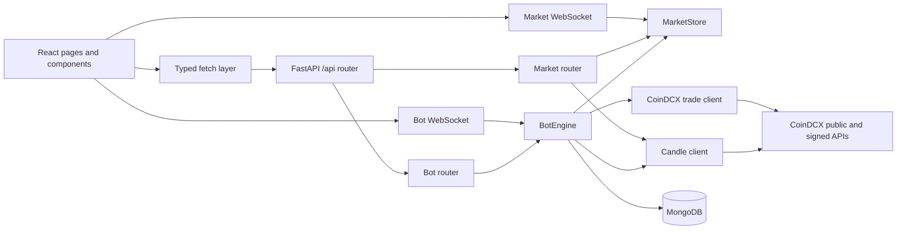

# Scalping

Scalping is a full-stack **CoinDCX futures scanner and strategy bot**. The backend
collects live market prices, ranks instruments by 24-hour movement, evaluates
timeframe candle signals, and executes in PAPER mode by default until the user
explicitly enables live trading after saving valid API credentials. The React
frontend provides the scanner, bot control, live positions, trade history, API
credential controls, admin login gating, and streaming logs.

## Project status

The repository is organized as a FastAPI backend and React/Vite frontend. The
focused source checks are:

- `cd backend && pytest -q`
- `cd frontend && npm run typecheck`
- Backend HTTP integration tests expect a running service at `localhost:8001`.
- The repository does not include `backend/.env.example`; create `backend/.env`
  manually from [PRODUCTION_SETUP.md](PRODUCTION_SETUP.md) and keep it untracked.

This repo uses a dynamic strategy architecture: strategy definitions and runtime
values live in the strategy modules and registry, and the engine/UI read those
values through shared metadata instead of hardcoded rule-specific branches.
The app still requires a real CoinDCX API key and secret plus an explicit live-trading
 toggle set to `true` before any live orders are placed.

The live order fill logic is verified to use the exchange order-status path when
`trade.live_enabled()` is true; the paper shortcut is intentionally ignored in that
mode to stop false-positive fills from a stale ticker.

## Operational notes

- Mongo configuration uses `MONGODB_URI` for either a local or cloud URI, together
  with `DB_NAME`.
- The login flow uses a built-in admin bootstrap (`admin` / `kunal` by default)
  and the frontend protects private routes until the user is authenticated.
- The runtime keeps the live CoinDCX order path gated behind valid credentials and
  the explicit live-trading switch, so paper mode stays safe by default.
- Strategy templates are dynamic and registry-driven; runtime config is owned by the
  selected strategy module, not duplicated inside the engine or UI.

---

## 📖 Documentation

| Document | Contents |
|----------|----------|
| **[ARCHITECTURE.md](ARCHITECTURE.md)** | **Complete system design** - Data flow, component relationships, function catalog, WebSocket protocol, MongoDB schema, trading lifecycle state machine |
| [SETUP_GUIDE.txt](SETUP_GUIDE.txt) | Installation & deployment on Ubuntu/Docker |
| [docs/DEPLOY_DIGITALOCEAN.md](docs/DEPLOY_DIGITALOCEAN.md) | Production deployment |
| [docs/DEPLOY_RENDER.md](docs/DEPLOY_RENDER.md) | Render Docker deployment |
| [memory/SPEC.md](memory/SPEC.md) | Product specification |

**Start here:** Read [ARCHITECTURE.md](ARCHITECTURE.md) for a deep understanding of how everything connects.

---

## Architecture



### Runtime responsibilities

1. `backend/server.py` creates the FastAPI app, loads `.env`, mounts the
   `/api` router, and owns application startup/shutdown.
2. `backend/lib/market_store.py` polls CoinDCX futures metadata and prices,
   keeps the latest tickers in memory, calculates the top four instruments, and
   broadcasts snapshots to market WebSocket clients.
3. `backend/lib/bot_engine.py` is the strategy runtime. It schedules each
   strategy in Asia/Kolkata time, selects candidates, reads candles, places or
   simulates orders, monitors fills and positions, persists trades/logs, and
   broadcasts bot state.
4. `backend/lib/coindcx.py` and `backend/lib/candles.py` are public market data
   clients. `backend/lib/coindcx_trade.py` is the authenticated futures client
   and paper-trading boundary.
5. `backend/lib/db.py` creates the single shared Motor MongoDB client. Routers,
   credentials, and the engine import this shared `db` handle.
6. `frontend/src/hooks/` primes screens with REST and then keeps them current
   through reconnecting WebSockets. `frontend/src/lib/api.ts` keeps all REST
   calls relative to `/api`.

### Trading lifecycle

For every enabled strategy while the bot is on:

1. Wait for the next timeframe boundary inside the `05:30-03:40 IST` trading
   window. The window crosses midnight.
2. Prescan one minute before the boundary and rank the live market candidates.
3. Read the just-closed strategy candle. A green candle creates a buy signal; a
   red candle creates a sell signal; a doji is skipped.
4. Strategy rule sets can select the highest mover, the top-four reversal
   candidate, or the legacy top gainer/loser path.
5. Convert the INR capital cap to contract quantity using the USDT/INR rate,
   instrument metadata, leverage, and quantity increment.
6. Place or simulate an entry. Live orders are sent only when credentials exist
   and live trading is explicitly enabled.
7. Poll the order during its timeframe-specific fill window. Unfilled orders
   are cancelled and the runtime returns to waiting.
8. On a fill, attach TP/SL where supported, monitor live price, and persist the
   final trade result when the position exits.

Supported strategy timeframes are `5m`, `15m`, `1h`, `4h`, and `1d`. Candle API
resolutions additionally support `1m`, `2h`, `30m`, `1w`, and `1M`; `2h` is
synthesised from two hourly candles when the upstream does not return it.

## Repository layout

```text
scalping-bot/
  backend/
    server.py                 FastAPI app and lifespan
    requirements.txt          Python dependencies
    pytest.ini                Canonical pytest configuration
    lib/
      bot_engine.py           Strategy scheduler and execution state machine
      candles.py              Candle API client, normalisation, cache
      coindcx.py              Public CoinDCX metadata and price client
      coindcx_trade.py        Signed futures API and paper/live boundary
      credentials.py          CredentialsService and live-mode state
      config.py               ConfigService and typed environment access
      db.py                   Shared Motor client and database handle
      market_store.py         In-memory ticker store and price pollers
      wsutil.py               WebSocket registration and queue handling
    models/
      bot.py                   Strategy, trade, position, state models
      market.py                Ticker, snapshot, and candle models
    routers/
      bot.py                   /api/bot REST and WebSocket routes
      market.py                /api/market REST and WebSocket routes
    tests/                     Backend API and engine tests
  frontend/
    src/
      App.tsx                 Route table
      main.tsx                React, Query, and BrowserRouter bootstrap
      pages/                  Dashboard, bot, position, and history screens
      components/              Feature components and UI primitives
      hooks/                  Market and bot streaming hooks
      lib/                    API client and TypeScript contracts
    package.json              Vite, React, Query, Tailwind, and UI dependencies
  tests/
    playwright.config.ts      End-to-end test configuration
    e2e/                      Browser journey tests
  docs/                       Deployment and strategy editing notes
  memory/SPEC.md              Product/implementation specification
  SETUP_GUIDE.txt             Ubuntu setup and run guide
  backend/.env                Local environment file (create locally; never commit)
```

## API reference

All HTTP routes are relative to `/api`. In development, Vite proxies them to
the backend on port `8001`.

### Market routes

| Method | Path | Purpose |
| --- | --- | --- |
| `GET` | `/market/snapshot` | Current ticker snapshot and top four instruments |
| `GET` | `/market/instrument/{pair}` | One live instrument |
| `GET` | `/market/candles/{pair}?resolution=5m&limit=60` | Historical candles |
| `WS` | `/api/ws` | Live market snapshots |

### Bot routes

| Method | Path | Purpose |
| --- | --- | --- |
| `GET` | `/bot/state` | Bot mode, window, time, and strategies |
| `POST` | `/bot/toggle` | Start or stop the bot with `{ "on": true }` |
| `GET` | `/bot/strategies` | List strategies |
| `POST` | `/bot/strategies` | Create and persist a strategy |
| `DELETE` | `/bot/strategies/{sid}` | Delete a strategy |
| `POST` | `/bot/strategies/{sid}/enabled` | Arm or disarm one strategy |
| `GET` | `/bot/logs` | In-memory recent engine logs |
| `GET` | `/bot/trades` | Persisted trades, optionally filtered by date |
| `GET` | `/bot/positions` | Pending orders and open positions |
| `GET` | `/bot/history/today` | Today's P&L and trade summary |
| `GET` | `/bot/history/daily` | Daily P&L buckets for the calendar |
| `GET` | `/bot/credentials` | Masked credential status |
| `POST` | `/bot/credentials` | Save API key and secret |
| `DELETE` | `/bot/credentials` | Clear credentials and return to PAPER |
| `POST` | `/bot/credentials/live` | Explicitly enable or disable live orders |
| `GET` | `/bot/trade-api-audit` | Sanitized MongoDB audit of signed CoinDCX requests, responses, and errors |
| `WS` | `/bot/ws` | Bot state, log, and backlog events |

The starter health/demo routes also remain available as `GET /api/` and
`GET|POST /api/status`.

## Function catalog

The following names are the main implementation entry points. Private helpers
are included where they define important behavior.

### Backend application and routers

- `server.lifespan`, `server.root`, `server.create_status_check`,
  `server.get_status_checks`
- `routers.market.get_candle_series`, `routers.market.get_snapshot`,
  `routers.market.get_instrument`, `routers.market.market_ws`
- `routers.bot.get_state`, `routers.bot.toggle_bot`,
  `routers.bot.list_strategies`, `routers.bot.create_strategy`,
  `routers.bot.delete_strategy`, `routers.bot.set_enabled`,
  `routers.bot.get_logs`, `routers.bot.get_trades`,
  `routers.bot.get_credentials`, `routers.bot.set_credentials`,
  `routers.bot.delete_credentials`, `routers.bot.set_live_trading`,
  `routers.bot.get_positions`, `routers.bot.today_summary`,
  `routers.bot.daily_history`, `routers.bot.bot_ws`

### Bot engine: decisions and lifecycle

- Helpers: `now_ist`, `in_window`, `order_window`, `next_slot`, `candle_side`,
  `candle_close_label`, `tp_sl_for`, `pnl_pct_for`, `filled_quantity`,
  `position_is_open`, `send_order_with_retry`
- Runtime state: `BotEngine.subscribe`, `BotEngine.unsubscribe`,
  `BotEngine.log`, `BotEngine.state`, `BotEngine.positions`,
  `BotEngine.load`, `BotEngine.stop`, `BotEngine.add`,
  `BotEngine.remove`, `BotEngine.set_enabled`, `BotEngine.set_bot`
- Scheduler and selection: `BotEngine._loop`, `BotEngine._tick`,
  `BotEngine._ranked`, `BotEngine._prescan`, `BotEngine._select`,
  `BotEngine._select_highest_mover`, `BotEngine._select_reversal_candidate`,
  `BotEngine._await_reversal_trigger`
- Execution: `BotEngine._place`, `BotEngine._order_snapshot`,
  `BotEngine._await_fill`, `BotEngine._on_filled`,
  `BotEngine._finalize_partial_fill`, `BotEngine._cancel_unfilled`,
  `BotEngine._mark_open`, `BotEngine._monitor`,
  `BotEngine._finalize_closed_elsewhere`, `BotEngine._reset`

### Backend integrations and persistence

- Market: `MarketStore.snapshot`, `MarketStore.subscribe`,
  `MarketStore.unsubscribe`, `MarketStore._apply`, `MarketStore.start`,
  `MarketStore.stop`, `MarketStore._price_loop`, `MarketStore._leverage_loop`
- Public CoinDCX: `fetch_active_instruments`, `fetch_prices`,
  `load_cached_leverage`, `fetch_leverage`
- Candles: `get_candles`, `_fetch`, `_normalise`, `_merge_pairs`
- Authenticated trading: `signed_post`, `inr_instruments`, `usdt_inr_rate`,
  `instrument_detail`, `max_leverage_for`, `order_quantity`,
  `inr_wallet_balance`, `place_market`, `place_limit`, `order_status`,
  `cancel_order`, `open_positions`, `attach_tpsl`, `set_leverage`,
  `exit_position`
- Credentials and WebSockets: `credentials.load`, `credentials.save`,
  `credentials.clear`, `credentials.set_live`, `credentials.status`,
  `wsutil.register`, `wsutil.unregister`, `wsutil.next_payload`,
  `wsutil.close_all`

### Frontend entry points

- App/bootstrap: `App`, `main`, `apiGet`, `apiPost`, `apiPut`, `apiPatch`,
  `apiDelete`, `request`
- Pages: `Dashboard`, `BotControl`, `PositionMonitor`, `TradeHistory`
- Streaming hooks: `useMarketStream`, `useBotStream`, `wsUrl`, `dedupe`
- Bot components: `AddStrategyDialog`, `ApiKeysDialog`, `LogConsole`,
  `PnlCalendar`, `StrategyList`
- Dashboard components: `CandleChart`, `InstrumentTable`, `TopGainerBox`

## Data and configuration

MongoDB collections used by the application:

- `settings`: credentials, live-trading switch, and runtime bot setting
- `strategies`: persisted strategy definitions and status
- `trades`: opened and closed trade records
- `bot_logs`: durable engine log entries
- `status_checks`: starter/demo endpoint records

Create `backend/.env` locally and never commit real credentials:

```dotenv
MONGODB_URI=mongodb://127.0.0.1:27017
DB_NAME=scalping
ADMIN_EMAIL=admin
ADMIN_PASSWORD=kunal
SECOND_ADMIN_EMAIL=
SECOND_ADMIN_PASSWORD=
APP_URL=http://localhost:3000
COINDCX_BASE_URL=https://api.coindcx.com
COINDCX_WS_URL=https://stream.coindcx.com
COINDCX_WS_PRICE_CHANNEL=currentPrices@futures@rt
```

Add CoinDCX credentials from the API Keys UI; they are encrypted and stored per user
in MongoDB and are never read from `.env`. The live execution gate is enforced at runtime: valid credentials plus an explicit
live toggle are required before real orders are sent. API secrets are stored in
Mongo for runtime rotation, but only masked tails are returned by the API.

## Setup and running

See `SETUP_GUIDE.txt` for Ubuntu, Docker MongoDB, Python, and Yarn setup. Once
dependencies are installed, run the services in separate terminals:

```bash
# Terminal 1
cd backend
python3 -m uvicorn server:app --host 0.0.0.0 --port 8001

# Terminal 2
cd frontend
yarn dev --host 0.0.0.0 --port 3000
```

Open `http://localhost:3000`. The backend can be checked with:

```bash
curl http://127.0.0.1:8001/api/market/snapshot
```

## Testing and validation

Backend tests run against the configured backend URL. `backend/pytest.ini` is
the canonical pytest configuration:

```bash
cd backend
pytest
```

Frontend type checking and linting:

```bash
cd frontend
yarn typecheck
yarn lint
```

Playwright tests are configured under `tests/`, but `tests/e2e/` currently contains
only a placeholder. The backend suite covers strategy CRUD and validation,
CoinDCX signed routes, credential validation, error responses, candle resolution
validation, strategy trigger selection, and order fill/cancel behavior.

## Operational notes

- Keep route handlers under the `/api` router; frontend requests rely on the
  Vite `/api` proxy.
- Use the shared `lib.db.db` handle instead of creating another Mongo client.
- Keep Pydantic models in `backend/models/` and matching TypeScript contracts in
  `frontend/src/lib/` synchronized manually.
- Market data is in-memory and rebuilt after a backend restart. Strategies,
  credentials, logs, and trades are persisted in MongoDB.
- WebSocket clients receive an initial snapshot/backlog, then reconnect after a
  three-second delay when disconnected.
- The exchange boundary uses INR margin while chart signals and contract prices
  use CoinDCX USDT-named futures pairs.