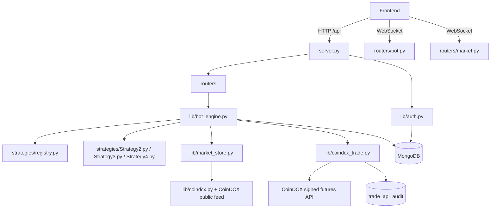

# Backend Guide

This directory contains the FastAPI backend for the CoinDCX futures scalping bot. It owns authentication, per-user bot engines, market data, strategy execution, paper/live orders, MongoDB persistence, and WebSocket updates.

## Runtime Flow



### 1. Application startup

`server.py` creates the FastAPI app and registers the `/api` router. Its lifespan performs these startup actions:

1. Loads environment values from `backend/.env`.
2. Bootstraps configured admin users through `lib/auth.py`.
3. Loads persisted credential state through `lib/credentials.py`.
4. Starts the market feed through `lib/market_store.py`.
5. Creates and loads the default `admin` engine through `get_engine("admin")`.
6. On shutdown, closes WebSockets, stops the admin engine and market store, and closes MongoDB.

### 2. Login and admin selection

`POST /api/login` validates the email and password and stores the normalized email in the signed session cookie as `user_id`.

`routers/bot.py` reads that session value in `session_user_id()`. `user_engine(request)` then:

1. Selects the current user ID.
2. Switches the runtime credential context with `credentials.set_user(user_id)`.
3. Gets one cached `BotEngine` for that owner.
4. Loads the engine from MongoDB if it is not loaded.

The owner ID is intended to isolate strategies, trades, logs, audit records, and WebSocket state between admins.

### 3. Market data flow

`lib/market_store.py` maintains the live CoinDCX futures price feed. It updates in-memory tickers, calculates 24-hour movement, ranks the top movers, and broadcasts snapshots to market WebSocket subscribers.

`lib/coindcx.py` contains unauthenticated public CoinDCX REST calls for tickers, instruments, leverage metadata, and market information.

`lib/candles.py` fetches and normalizes candle data. The bot engine uses these candles for strategy signals and historical tests.

### 4. Strategy flow

`strategies/registry.py` maps strategy names/rule sets to implementation classes and exposes template metadata used by the frontend.

- `Strategy2.py`: reversal strategy. It uses the configured higher-timeframe match and then confirms a 1-minute Green-to-Red entry for a short signal.
- `Strategy3.py`: strongest positive mover short strategy.
- `Strategy4.py`: additional strategy module that currently follows the existing reversal pattern.

The engine schedules enabled strategies by timeframe. During a scan it ranks candidates from the live feed, fetches candles, evaluates the rule, chooses a candidate, calculates quantity, and submits a paper or live order.

### 5. Order and position flow

`lib/bot_engine.py` is the execution state machine:

1. Scan the ranked market feed.
2. Evaluate the configured strategy signal.
3. Resolve an INR-tradable instrument and metadata.
4. Convert INR capital to USDT notional and calculate exchange-compliant quantity.
5. Submit a market or limit order through `OrderService`.
6. For live fills, obtain the exchange position ID from the order response or `/exchange/v1/derivatives/futures/positions`.
7. Mark the runtime position open and calculate TP/SL.
8. Call `/exchange/v1/derivatives/futures/positions/create_tpsl` with the position `id`.
9. Monitor price and exchange position status.
10. Exit on TP, SL, manual exit, liquidation, or configured close behavior.
11. Persist the final trade, P&L, and logs in MongoDB.

`lib/coindcx_trade.py` implements the private CoinDCX client. It signs requests with HMAC-SHA256 and millisecond timestamps, pins futures orders to `margin_currency_short_name: "INR"`, reads the INR futures wallet, gets positions, attaches TP/SL, updates leverage, and exits positions.

CoinDCX officially returns a position object with:

- `id`: stable position ID
- `pair`: futures pair
- `active_pos`: positive for long and negative for short
- `take_profit_trigger` and `stop_loss_trigger`: current exchange triggers

The backend also accepts directional `active_pos_buy` and `active_pos_sell` fields seen in some live responses. Position lists are preserved so reconciliation can inspect every returned position.

### 6. API routes

All routes below are under `/api`.

#### Authentication

- `POST /login`
- `GET /session`
- `POST /logout`

#### Market routes in `routers/market.py`

- `GET /market/snapshot`
- `GET /market/instrument/{pair}`
- `GET /market/candles/{pair}`
- WebSocket `/api/ws`

#### Bot routes in `routers/bot.py`

- `GET /bot/state`
- `POST /bot/toggle`
- `GET /bot/logs`
- `GET /bot/trades`
- `GET /bot/positions`
- `GET /bot/history/today`
- `GET /bot/history/daily`
- `GET /bot/strategies`
- `POST /bot/strategies`
- `PUT /bot/strategies/{sid}`
- `DELETE /bot/strategies/{sid}`
- `POST /bot/strategies/{sid}/enabled`
- `POST /bot/historical-test`
- `GET /bot/credentials`
- `POST /bot/credentials`
- `DELETE /bot/credentials`
- `POST /bot/credentials/validate`
- `POST /bot/credentials/live`
- `GET /bot/trade-api-audit`
- WebSocket `/bot/ws`

### 7. Persistence and ownership

`lib/db.py` creates one Motor MongoDB client and exposes the configured database. Important collections are:

- `users`: configured admin accounts
- `settings`: per-user CoinDCX credential and live-mode state
- `strategies`: strategy configuration and runtime state, filtered by `owner_id`
- `trades`: trade records and P&L, filtered by `owner_id`
- `bot_logs`: execution logs, filtered by `owner_id`
- `trade_api_audit`: sanitized CoinDCX request/response records

Every persisted trade must use the current `BotEngine.owner_id`. History endpoints query the current session owner and optionally filter `opened_at` by date.

### 8. Supporting modules

| File | Responsibility |
| --- | --- |
| `server.py` | FastAPI app, startup/shutdown, sessions, route registration |
| `lib/auth.py` | Admin configuration, login validation, user bootstrap |
| `lib/db.py` | MongoDB client and database handle |
| `lib/config.py` | Typed environment settings and runtime constants |
| `lib/credentials.py` | Per-user runtime credential state and live toggle |
| `lib/market_store.py` | Live price feed, ticker cache, market broadcasts |
| `lib/coindcx.py` | Public CoinDCX market API client |
| `lib/candles.py` | Candle REST client, normalization, and cache |
| `lib/clock.py` | Exchange/server time synchronization and IST helpers |
| `lib/coindcx_trade.py` | Signed private futures API client and API audit logging |
| `lib/bot_engine.py` | Scheduling, strategy execution, orders, fills, exits, persistence |
| `lib/historical_test.py` | Historical candle/mover simulation |
| `lib/wsutil.py` | WebSocket registration and cleanup |
| `models/bot.py` | Strategy, trade, credential, position, and summary contracts |
| `models/market.py` | Ticker, snapshot, and candle contracts |
| `routers/bot.py` | Bot controls, strategy CRUD, credentials, history, bot WebSocket |
| `routers/market.py` | Market REST routes and market WebSocket |
| `strategies/registry.py` | Strategy registry and frontend template metadata |
| `strategies/Strategy*.py` | Strategy signal implementations |

Empty `__init__.py` files only mark Python packages.

## Configuration

Required values:

```env
MONGODB_URI=...
DB_NAME=scalping
ADMIN_EMAIL=...
ADMIN_PASSWORD=...
SECOND_ADMIN_EMAIL=...
SECOND_ADMIN_PASSWORD=...
SESSION_SECRET=use-a-long-random-production-secret
```

CoinDCX credentials must be added through the credentials API/UI. They are encrypted and stored per user in MongoDB; the environment never supplies or overrides them. Keep API keys read-only plus futures-trading enabled and never enable withdrawals.

Do not use `CORS_ORIGINS="*"` with credentialed sessions in production. Use an explicit frontend origin allowlist. Also ensure every `.env` line is valid `KEY=value` syntax.

Generate `CREDENTIAL_ENCRYPTION_KEY` once with `python3 -c "from cryptography.fernet import Fernet; print(Fernet.generate_key().decode())"` and keep the same value across restarts and deployments. Rotating it without re-encrypting existing settings makes saved CoinDCX credentials unreadable.

## Testing

From this directory:

```bash
python3 -m compileall -q .
pytest -q
pytest -q tests/test_tscheck_coindcx_signed_routes.py
pytest -q tests/test_tscheck_bot_engine_fill_path.py
```

The endpoint tests in `tests/conftest.py` expect a backend server at `http://localhost:8001`. Start it from this directory with:

```bash
python3 -m uvicorn server:app --host 0.0.0.0 --port 8001
```

The CoinDCX route tests use deliberately invalid credentials or mocks; they must never place a real order.

## Known Risks Found In Review

These operational risks require explicit production procedures and follow-up hardening:

1. A strategy can be deleted or disabled while an exchange position is live, which can orphan local monitoring and exits. Reconcile and close the exchange position first.
2. Retrying an order after a network timeout can duplicate a real order unless the exchange is queried by client order identity before retrying.
3. A failed exchange exit must be treated as unresolved until the exchange position is confirmed closed; local trade state alone is not authoritative.
4. A position-link or TP/SL attachment timeout can leave an exchange position open without protection. Escalate these cases for manual reconciliation.
5. Credential rotation while live mode is enabled needs an operational pause and a fresh validation before live execution resumes.
6. Existing tests do not fully cover authorization, two-admin isolation, credential isolation, WebSocket origin policy, or ambiguous live-order failures.

## Troubleshooting

- **Trade visible for one admin but not another:** check `trades.owner_id`, the session email, and the engine owner. The history query intentionally filters by the authenticated owner.
- **Position ID unresolved:** inspect `trade-api-audit` for `/positions`. The response must contain a non-zero `active_pos` and an `id` for the requested pair; TP/SL cannot be attached without that ID.
- **TP/SL missing:** inspect the audit record for `/positions/create_tpsl`, then check `take_profit_trigger` and `stop_loss_trigger` in the next position response.
- **Backend tests show connection refused:** start Uvicorn on port 8001 before endpoint tests, or run only in-process unit tests.
- **Environment parse warning:** inspect every `.env` line for an accidental quote or extra text after a value.
